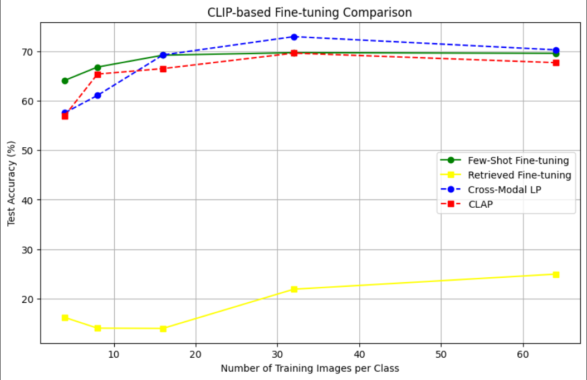
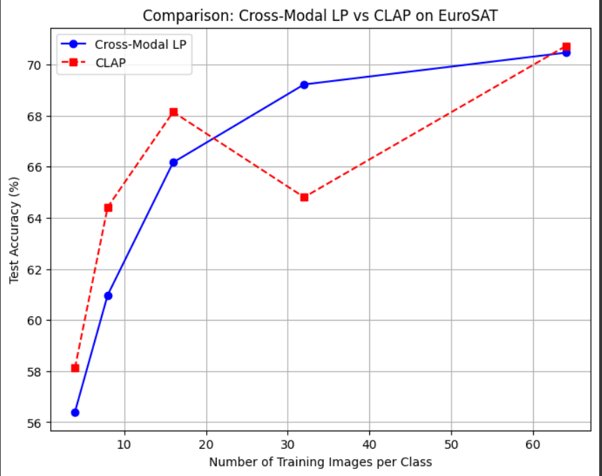

# 🔍 CLIP-based Fine-tuning Comparison

This project presents a comparative study of various CLIP-based fine-tuning techniques for image classification tasks under limited data regimes. The objective is to explore how well different methods adapt with few training images per class, particularly in domains like remote sensing (e.g., EuroSAT dataset).

## 📁 Project Files

- `Few_Shot_test_run.ipynb`: The main notebook containing the implementation and evaluation of fine-tuning strategies.
- `fineTuningComparison.png`: Visual comparison across four CLIP-based methods.
- `LPvsCLAP.png`: Head-to-head performance comparison of Cross-Modal LP and CLAP on EuroSAT.

---

## 🚀 Fine-tuning Strategies Compared

1. **Few-Shot Fine-tuning** ✅  
   A traditional approach using a small number of labeled samples.

2. **Retrieved Fine-tuning** 🔄  
   Fine-tuning based on samples retrieved from a large corpus using CLIP similarity.

3. **Cross-Modal Linear Probing (LP)** 🔵  
   Uses the pretrained CLIP text encoder to generate class embeddings and performs linear probing on the image embeddings.

4. **CLAP (Contrastive Language-Image Pretraining)** 🔴  
   Fine-tuning that optimizes contrastive loss with both modalities during training.

---

## 📊 Results Overview

### 📌 CLIP-based Fine-tuning Comparison



- **Few-Shot Fine-tuning** consistently performs well with increasing images per class.
- **Cross-Modal LP** scales better and even outperforms others at higher data availability.
- **Retrieved Fine-tuning** shows poor performance, indicating retrieval noise may hinder learning.
- **CLAP** shows strong initial performance but plateaus after 32 images/class.

---

### 📌 Cross-Modal LP vs CLAP on EuroSAT



- At lower data (≤16 images/class), **CLAP** has a slight edge.
- Beyond 16 images/class, **Cross-Modal LP** becomes more reliable and stable.
- At 64 images/class, **CLAP** slightly overtakes, suggesting potential late-stage generalization.

---

## 🧪 How to Run

1. Clone the repository:
   ```bash
   git clone https://github.com/cschauhan0304/Few_Shot_Recognition_SWAT.git
   cd Few_Shot_Recognition_SWAT
